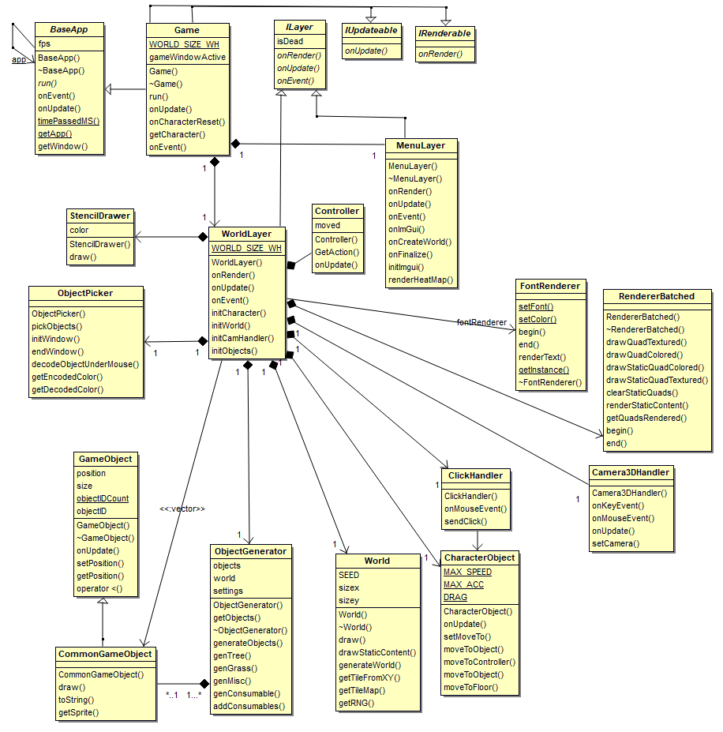

# Game Logic Overview
The Game Logic subset of classes correspond to all game functionality and to instantiate the game and its members. Layers have been introduced such to imitate that of Java's JPanel design, allowing for the world to be rendered first and any layers on top of it. The intention is to have HUD layer, displaying character inventory information, and a Menu layer for when an interactive menu can be implemented. This way the world is drawn first, HUD second, and Menu last. Events can then be sent down the layer stack with the topmost layer responding to events first.   
   
Separate classes are as follows:  
  
1. Interfaces
	1. [ILayer](#ilayer-overview)
	2. [IRenderable](#irenderable-overview)
	3. [IUpdateable](#iupdateable-overview)
1. [Game](#game-overview)
2. [World Layer](#world-layer-overview)
3. [Menu Layer](#menu-layer-overview)
  
  
*Class diagram of associated game classes and their related instances.  
  
## ILayer Overview  
ILayer is a pure virtual class, extending interface. Derived classes are required to provide implementation for the following methods (a typical render cycle):
  
**onRender()** - for layers to perform any rendering related methods.  
**onUpdateDT(float)** - for layers to update their associated members.  
**onEvent(GE::Event)** - for layers to respond to any events, or delegate the responsibility to respond to their members.  

### Implementation 
[ILayer.h](https://cseegit.essex.ac.uk/ce301_2020/ce301_allport_michael_s/-/blob/master/GameEngine/src/App/Layers/ILayer.h)  
  
## IRenderable Overview  
IRenderable is a pure virtual class offering one member, onRender() which happens each frame in the Game Loop.  
  
### Implementation  
[Interfaces.h](https://cseegit.essex.ac.uk/ce301_2020/ce301_allport_michael_s/-/tree/master/GameEngine/src/App)  
  
## IUpdateable  Overview
A pure virtual interface providing onUpdate() method with no argumentss, for any classes who perform time independent updates per frame.  
  
### Implementation  
[Interfaces.h](https://cseegit.essex.ac.uk/ce301_2020/ce301_allport_michael_s/-/tree/master/GameEngine/src/App)  
  
## Game Overview  
Games sole responsibility is for the following:  
- Instantiating World/Menu Layers  
- Implementing GE::EventHandler class to subscribe and post all events down the layer stack  
- Initialize GE::TexturePacks  
- Extending GE::BaseApp class, thereby creating a window context   
- Maintain the game loop calling onUpdate and onRender methods to layers as BaseApp as needed  

### Implementation  
[Game.cpp](https://cseegit.essex.ac.uk/ce301_2020/ce301_allport_michael_s/-/blob/master/GameEngine/src/App/Game.cpp)  
[Game.h](https://cseegit.essex.ac.uk/ce301_2020/ce301_allport_michael_s/-/blob/master/GameEngine/src/App/Game.h)  
  
### Main method identification   
**onEvent(Event)** - forwards events down the layer stack.  
**run()** - the method containing the main Game Loop, calling layers to perform onUpdate and onRender.  
**onUpdate()** - calls BaseApp's method, required each fram.e  
  
## World Layer Overview  
World layer is the more complex of the layers, it contains numerous members and functions enabling the game:  
- Instantiates a world, renderers, input controllers, the game objects, character etc.  
- Pertains an onRenderLoop which sorts objects and filters depending on whether they are within the viewing frustrum and able to be rendered.  
- Updates associated objects each frame.  
- Filters events more mouse scrolled and pressed events thereby moving the character.  

### Implementation  
[WorldLayer.cpp](https://cseegit.essex.ac.uk/ce301_2020/ce301_allport_michael_s/-/blob/master/GameEngine/src/App/Layers/WorldLayer.cpp)  
[WorldLayer.h](https://cseegit.essex.ac.uk/ce301_2020/ce301_allport_michael_s/-/blob/master/GameEngine/src/App/Layers/WorldLayer.h)  
  
### Main method identification  
**initCharacter()** - initializes the character object.  
**initWorld()** - instantiates the world and renderer, calling World::generateWorld(Settings) with its local WorldSettings instance.  
**initCamHandler()** - initializes the camera handler, whilst associated it with the character for its position.  
**initObjects()** - Instantiates an ObjectPicker, and a PCG ObjectGenerator for object generation.  
**onRender()** - This is the main render loop for all associated objects. Mainly, all objects are sorted in back to front sorting enabling objects to be rendered in correct order. We then create a list of renderable objects, using Sprite::isRenderable method for each object. The object under the mouse is then attained, through ObjectPicker::pickObjects method. All objects are then drawn using the default renderer, unless the object is that under the mouse, then a StencilBuffer is used to render the object.  
  
## Menu Layer Overview  
Menu layer is a more simplistic layer. This was a last-minute addition, providing a very basic menu to parameterize the PCG generation methods in MapGenerator and ObjectGenerator classes. Users can alter the hyper parameters, generate numerous worlds, and finalize the game with a play button. This layer has to take reference of the WorldLayer class on creation, such that it has access to the WorldLayer's settings and initialization methods to reset the world.  
  
### Implementation  
[MenuLayer.cpp](https://cseegit.essex.ac.uk/ce301_2020/ce301_allport_michael_s/-/blob/master/GameEngine/src/App/Layers/MenuLayer.cpp)  
[MenuLayer.h](https://cseegit.essex.ac.uk/ce301_2020/ce301_allport_michael_s/-/blob/master/GameEngine/src/App/Layers/MenuLayer.h)  
  
### Main method identification  
**onRender()** - Calls library ImGui functionality to create the basic menu.  
**onEvent()** - Unless the event is MouseScrolled (for Zoom), all events are set to handled such that no other layers will respond to the event.  
**renderHeatMap()** - Functionality to overlay a red map with opacity governed by Perlin noise function, mimicking the ObjectGenerator's behaviour.  
**onCreateWorld()** - Used to reset the world on the click of 'Generate World' button by calling WorldLayer methods.  
**initImGui()** - Required to be able to have ImGui menu context.  
