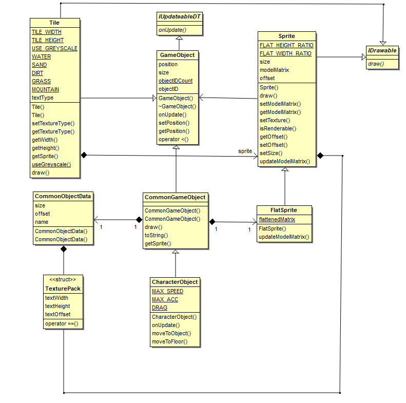

# Game Objects Overview 
The game world is full of objects, from Trees, shrubs, twigs, to the floor tiles and the character object. All objects require to exist at a position in world space and contain member functions to update their position and rendering their representation to screen. this is where the Game Objects subset of classes come in to play. The Sprite class, and it's derivative FlatSprite, contain the logic needed to render an object to screen. Whilst the GameObject class and its derivatives contain logic on updating an objects position.  
  
Data classes have been made such to store generic data about an objects size, what Texture's require rendering, and if there are any offsets that need applying to centre a texture relative to its 0,0,0 position.  
  
1. Interfaces  
	1.1 [IUpdateableDT](#iupdateable-overview)  
	1.2 [IDrawable](#idrawable-overview)  
2. [Game Object](#game-object-overview)  
3. [Common Game Object](#common-game-object-overview)  
4. [Character Object](#character-object-overview)  
5. [Tile](#tile-overview)  
6. [Sprite](#sprite-overview)  
7. [FlatSprite](#flat-sprite-overview)  
8. [Common Object Data](#common-object-data-overview)  
  
  
*Class diagram for main GameObjects related classes*  
  
## IUpdateable Overview  
IUpdateableDT is intended to be implemented by any class requiring updating each frame requiring time passed to factor in their update methods. Derived classes should realise onUpdate(float) method.  

## IDrawable Overview
IDrawable is intended to be implemented by any class using the GE::Renderer class to draw quads to screen. Derived classes must realise draw(GE::Renderer) method.  
  
### Implementations
[Interfaces.h](https://cseegit.essex.ac.uk/ce301_2020/ce301_allport_michael_s/-/blob/master/GameEngine/src/App/Interfaces.h)

## Game Object Overview  
The GameObject class is intended for in-game objects that exist in world space. This contains methods and members necessary to update an objects position, or simply store position in world space. The class contains a virtual onUpdate method, but also provides a default implementation which translates it's position relative to its velocity Vector2D class. When an object has moved position, a boolean 'hasMoved' is set to true, allowing for Sprite classes to adjust their model transformation matrices accordingly.  
  
GameObject also records an objects ID, containing static objectIDCount member. Upon each object made the ID assigned to the instance crated and is incremented.  

### Implementation  
[GameObject.cpp](https://cseegit.essex.ac.uk/ce301_2020/ce301_allport_michael_s/-/blob/master/GameEngine/src/App/GameObject.cpp)  
[GameObject.h](https://cseegit.essex.ac.uk/ce301_2020/ce301_allport_michael_s/-/blob/master/GameEngine/src/App/GameObject.h)  

### Main method identification  
**onUpdateDT(float)** - Virtual method, provides a standard implementation for updating the objects position relative to it's velocity vector, position += velocity \* DT.  
**setPosition(Vector2D)** - Allows external classes to change an objects position.  
**operator<(GameObject&, GameObject&)** - Enables sorting of game objects, in ascending value of distance from 0,0,0 world origin such that objects closest to screen are drawn last.  
  
## Common Game Object Overview
CommonGameObject extends GameObject, inheriting its base members and functionality. However, CommonGameObjects contain an associated FlatSprite member, where FlatSprite's have custom model matrices applied which negate \/w operations performed during a perspective transformation. This class is used for all objects being rendered to imitate 2D.  
  
### Implementation  
[Nested Class in GameObject.cpp](https://cseegit.essex.ac.uk/ce301_2020/ce301_allport_michael_s/-/blob/master/GameEngine/src/App/GameObject.cpp)  
[Nested Class in GameObject.h](https://cseegit.essex.ac.uk/ce301_2020/ce301_allport_michael_s/-/blob/master/GameEngine/src/App/GameObject.h)   
  
### Main method identification  
None, merely constructs differently with additional members.  
  
## Character Object Overview  
CharacterObject inherits both GameObject and CommonGameObject methods and members. However, given a characters position is determined by user input, methods are provided such that external controller classes can move the character. Also provided is ability to set the character's move to position, used when objects are clicked in game or floor is clicked to move to pointer.  

### Implementation  
[CharacterObject.cpp](https://cseegit.essex.ac.uk/ce301_2020/ce301_allport_michael_s/-/blob/master/GameEngine/src/App/CharacterObject.cpp)   
[CharacterObject.h](https://cseegit.essex.ac.uk/ce301_2020/ce301_allport_michael_s/-/blob/master/GameEngine/src/App/CharacterObject.h)   
  
### Main method identification  
**setMoveTo(int, int)** - Sets the characters move to position, adjusting velocity accordingly through base CharacterObject::onUpdate method.  
**moveToObject(CommonGameObject)** - Sets the character to move to an object, objects have different stopping distances.  
**moveToFloor(int, int)** - Sets character to move to floor position, shorter stopping distance.  
  
## Tile Overview
Tile inherits from GameObject class, pertaining world position methods and members. Although the Tile class is unique from other GameObjects whereby no faux par 2D is required. Therefore, this is the only class that contains a sprite class and manually uses it with its own draw call implementation.
  
Given the Tile class related to the terrain, it also contains members to associate a noise value to the type of texture it belongs to. It is the only GameObject where the Texture type is not known on instantiation, therefore construction differs from any other object.  
  
### Implementation
[Tile.cpp](https://cseegit.essex.ac.uk/ce301_2020/ce301_allport_michael_s/-/blob/master/GameEngine/src/App/WorldGeneration/Tile.cpp)  
[Tile.h](https://cseegit.essex.ac.uk/ce301_2020/ce301_allport_michael_s/-/blob/master/GameEngine/src/App/WorldGeneration/Tile.h)  

### Main method identification
**setTextureType(float)** - Associates its texture type in relation to the input float and its type members and instantiates the Sprite instance for successive draw calls.  
**useGreyScale(bool)** - Used in previous version of the software during testing, this allows the tile to call renderQuadColor as opposed to texture, used in visualizing noise.  

## Sprite  Overview
Sprites purpose is to contain data member storing its model transformation, setting the model transformation to the renderer, setting its texture and storing other graphical related information. This is the main base class responsible for rendering graphics through GE::Renderer class.
  
### Implementation
[Sprite.cpp](https://cseegit.essex.ac.uk/ce301_2020/ce301_allport_michael_s/-/blob/master/GameEngine/src/App/Sprite.cpp)  
[Sprite.h](https://cseegit.essex.ac.uk/ce301_2020/ce301_allport_michael_s/-/blob/master/GameEngine/src/App/Sprite.h)  

### Main method identification  
**draw(GE::Renderer)** - Contains rendering implementation, which is virtual such that derived classes can override. Draw call checks if it is renderable using Renderer::isQuadInFrustrum method, if so it checks model matrix is set, updating if not, and then rendering.  
**isRenderable(GE::Renderer)** - Calls Renderer::IsQuadInFrustrum method an returns boolean specifying if it is in the frustrum or not.  
**updateModelMatrix()** - Sets the model matrix with translations depending upon it's offsets and scaling by it's size.  
**setOffsets()** - Sets the offsets used in translation during the model matrix, this is usually set by CommonGameObjectData offset information.  

## Flat Sprite Overview
FlatSprite inherits all of Sprites methods and data members, however the only difference is that the model matrix applies an additional transform negating the \/w operation done during perspective transform to make objects shrink in the distance.  
  
### Implementation
[Nested class in Sprite.cpp](https://cseegit.essex.ac.uk/ce301_2020/ce301_allport_michael_s/-/blob/master/GameEngine/src/App/Sprite.cpp)  
[Nested class in Sprite.h](https://cseegit.essex.ac.uk/ce301_2020/ce301_allport_michael_s/-/blob/master/GameEngine/src/App/Sprite.h)  
  
### Main method identification
**updateModelMatrix()** - Performs flatMatrix multiplication during model transform.  

## Common Object Data Overview
CommonObjectData allows enumeration of an objects shapes, its offsets used during rendering, its TexturePack information. This class facilitates in ease of object creating by use of enumerating common objects, these are then stored in utility class CommonObjectMap class.  
  
### Implementation  
[Nested Class in GameObject.cpp](https://cseegit.essex.ac.uk/ce301_2020/ce301_allport_michael_s/-/blob/master/GameEngine/src/App/GameObject.cpp)  
[Nested Class in GameObject.h](https://cseegit.essex.ac.uk/ce301_2020/ce301_allport_michael_s/-/blob/master/GameEngine/src/App/GameObject.h)  
