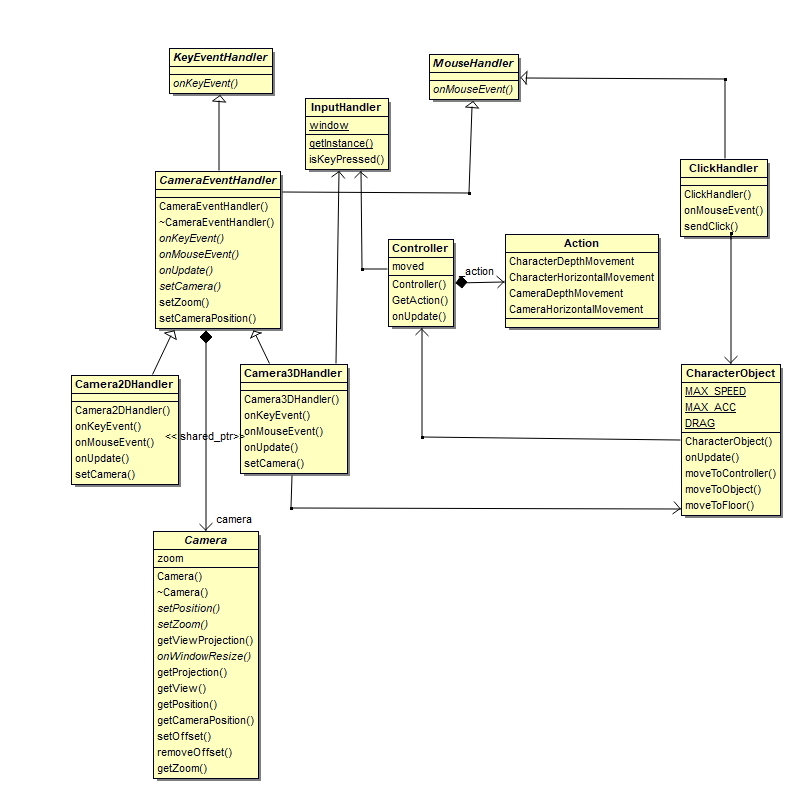

# Input Controller Overview
The input controller subset of classes are those of which that are responsible for actuating the movement of the Character object and the respective Camera objects upon user input. This is achieved commonly by realising KeyEventHandler or MouseHandler classes to react to an event, or to query the static InputHandler class which has functionality to determine if a key is pressed during an onUpdate() cycle.  
  
It was noted during manual testing of the input classes that responding to key events did not prove satisfactory in their response times. The GLFWPollEvents call did not respond to numerous keyHeld events, resulting in jagged movement of camera and character objects alike. A later design plan saw use of creating the InputHandler class to manually attain the status of keys pressed and held. However, the MouseEvents for scrolling and clicking were satisfactory.  

1. Interfaces  
	1.1 [KeyEventHandler](#keyeventhandler-overview)  
	1.2 [MouseEventHandler](#mouseeventhandler-overview)  
2. [CameraEventHandler](#cameraeventhandler-overview)  
3. [Camera2DHandler](#camera2dhandler-overview)  
4. [Camera3DHandler](#camera3dhandler-overview)  
5. [InputHandler](#inputhandler-overview)  
6. [Controller](#controller-overview)  
7. [Action](#action-overview)  
8. [ClickHandler](#clickhandler-overview)

  
*Class diagram for all input related classes*  
  
## KeyEventHandler Overview
KeyEventHandler defines virtual function onKeyEvent(GE::Event) and is to be realised by any input related class responding to key events.  

## MouseEventHandler Overview  
MouseEventHandler defines virtual function onMouseEvent(GE::Event) and is to be realised by input related class actuating mouse events.  

### Implementation
[EventHandlers.h](https://cseegit.essex.ac.uk/ce301_2020/ce301_allport_michael_s/-/blob/master/GameEngine/src/App/EventHandlers.h)  

## CameraEventHandler Overview  
CameraEventHandler extends both KeyEventHandler and MouseEventHandler whilst providing virtual functions for inherited methods. In addition, this class also provides virtual onUpdate(float) virtual method to be realised by derived 2D or 3D camera classes.  
  
This does provide implementation for the basic setZoom, setCamera(cam), and setCameraPosition member functions.  

### Implementation  
[CameraEventHandler.cpp](https://cseegit.essex.ac.uk/ce301_2020/ce301_allport_michael_s/-/blob/master/GameEngine/src/App/CameraEventHandler.cpp) 
[CameraEventHandler.h](https://cseegit.essex.ac.uk/ce301_2020/ce301_allport_michael_s/-/blob/master/GameEngine/src/App/CameraEventHandler.h)  

### Main method identification 
**setZoom(float)** - Sets this instances zoom to the input, allowing for external classes to assign zoom level of camera.  
**setCameraPosition(glm::vec3)** - Sets the position of this camera, such that external classes can move the cameras position.  
**setCamera(std::shared_ptr<GE::Camera>)** - Sets the active camera used to assign position/zoom upon user input. 

## Camera2DHandler Overview  
Camera2DHandler's purpose is to actuate camera movements upon user input, thus changing an Orthographic cameras x and y coordinates accordingly. This class also actuates mouse scrolled events increasing or decreasing the zoom levels for the associated camera for it's minimum and maximum zoom levels.

### Implementation  
[Nested class in CameraEventHandler.cpp](https://cseegit.essex.ac.uk/ce301_2020/ce301_allport_michael_s/-/blob/master/GameEngine/src/App/CameraEventHandler.cpp) 
[Nested class in CameraEventHandler.h](https://cseegit.essex.ac.uk/ce301_2020/ce301_allport_michael_s/-/blob/master/GameEngine/src/App/CameraEventHandler.h)  

### Main method identification  
**onUpdateDT(float)** - This method polls InputHandler class to check if any of the Camera Movement keys are pressed. If any key is, the cameraPosition vector is moved accordingly in relation to its translation speeds.  
**onMouseEvent(GE::Event)** - This method mainly checks for mouse scrolled events, and sets the zoom level desired for the 2D camera.  

## Camera3DHandler Overview  
Camera3DHandler acts extremely similar to Camera2DHandler. However, this instance moves in the x and z positions, given the perspective camera does not contain y axis movement. This instance also has different translation and zoom levels desirable. Furthermore, This class provides a lerp function such that the camera does not move at 100% of the characters speed the entire time, there is a small delay in between the character moving and the camera moving to match the characters speed. Where Lerp is a linear interpolation over its vector position changes.

### Implementation  
[Nested class in CameraEventHandler.cpp](https://cseegit.essex.ac.uk/ce301_2020/ce301_allport_michael_s/-/blob/master/GameEngine/src/App/CameraEventHandler.cpp) 
[Nested class in CameraEventHandler.h](https://cseegit.essex.ac.uk/ce301_2020/ce301_allport_michael_s/-/blob/master/GameEngine/src/App/CameraEventHandler.h)  

### Main method identification  
**onUpdateDT(float)** - This method polls InputHandler class to check if any of the Camera Movement keys are pressed. If any key is, the cameraPosition vector is moved accordingly in relation to its translation speeds in the x and z axis. In addition, a Lerping function in applied.    
**onMouseEvent(GE::Event)** - This method mainly checks for mouse scrolled events, and sets the zoom level desired for the 2D camera.  

## InputHandler Overview 
InputHandler is a static singleton class, such that any external class can obtain it's instance through use of static getInstance method. It's main purpose is to obtain the GLFW window instance in order to determine if a key is pressed. Keys are enumerated in the Game class in association with the GameEngine's key enumerations.  

### Implementation  
[InputHandler.h](https://cseegit.essex.ac.uk/ce301_2020/ce301_allport_michael_s/-/blob/master/GameEngine/src/App/InputHandler.h)  

### Main method identification  
**getInstance()** - Static method allowing access of the singleton instance.  
**isKeyPressed(int)** - Returns true if the key associated with the int input is pressed, false otherwise.  

## Controller Overview 
The Controller class takes inspiration from CE218 Game programming module. It utilizes an Action class, which contains integers of range -1 to 1 for character horizontal movement, vertical movement, and camera horizontal movement, and vertical movement. The controller class is bound to the character, and update on its onUpdate methods. User inputs are checked on update, and the action set accordingly. This enabled the Character instance to set movement direction according to the Action.

### Implementation  
[Controller.cpp](https://cseegit.essex.ac.uk/ce301_2020/ce301_allport_michael_s/-/blob/master/GameEngine/src/App/Controller.cpp)
[Controller.h](https://cseegit.essex.ac.uk/ce301_2020/ce301_allport_michael_s/-/blob/master/GameEngine/src/App/Controller.h)

### Main method identification  
**onUpdate()** - Checks user input via the InputHandler instance, and sets Action accordingly.

## Action Overview 
This is a basic data class containing integers of range -1 to 1 for character horizontal movement, vertical movement, and camera horizontal movement, and vertical movement.  

## ClickHandler Overview  
ClickHandler is a basic class that actuates mouse clicks to direct the player towards a position. Currently it only responds to left mouse clicks, and calls associated CharacterObject moveToObject or moveToFloot methods.  

### Implementation  
[ClickHandler.cpp](https://cseegit.essex.ac.uk/ce301_2020/ce301_allport_michael_s/-/blob/master/GameEngine/src/App/ClickHandler.cpp)  
[ClickHandler.h](https://cseegit.essex.ac.uk/ce301_2020/ce301_allport_michael_s/-/blob/master/GameEngine/src/App/ClickHandler.h)  

### Main method identification  
**onMouseEvent(GE::Event)** - This method attends to dynamically cast an event to a MouseClickedEvent. If the cast is successful, it calls sendClick with the mouse button which was pressed.  
**sendClick(GE::MouseButton)** - This method determines if the left mouse was clicked. It obtains the position of the mouse through MouseState class, checks if the position is within the rendering windows dimensions. If so, it checks if the mouses position belongs to the object under the mouse (if there is one). If there is an object under the mouse, CharacterObjects moveToObject method is called, if not then moveToFloor method is called.  

