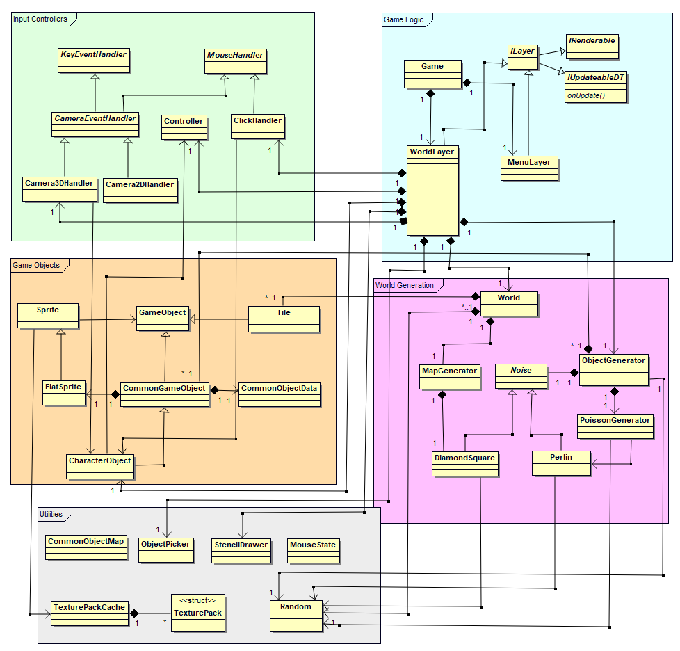

# Game Architecture Overview
The overall game design can be broken down into 5 subjections:  
  
1. [Game Logic](https://cseegit.essex.ac.uk/ce301_2020/ce301_allport_michael_s/-/tree/master/TechnicalDocumentation/Game/GameLogic#game-logic-overview) 
2. [World Generation](https://cseegit.essex.ac.uk/ce301_2020/ce301_allport_michael_s/-/tree/master/TechnicalDocumentation/Game/WorldGeneration#world-generation-overview)  
3. [Game Objects](https://cseegit.essex.ac.uk/ce301_2020/ce301_allport_michael_s/-/tree/master/TechnicalDocumentation/Game/GameObjects#game-objects-overview)  
4. [Input Controllers](https://cseegit.essex.ac.uk/ce301_2020/ce301_allport_michael_s/-/tree/master/TechnicalDocumentation/Game/InputControllers#input-controller-overview)  
5. [Utilities](https://cseegit.essex.ac.uk/ce301_2020/ce301_allport_michael_s/-/tree/master/TechnicalDocumentation/Game/Utilities#utilities-overview)  
  
All relevant classes have tried to be captured in the following package diagram; however, this is not an exhaustive diagram. Some classes make use of helper cache's, enumeration classes, or realise and use GameEngine subsystems. The separate links will provide a more thorough use of implementation details.  
  
  
*Overview of the important classes relevant to their subsections*  

## Game Logic
Classes here are responsible for controlling application related methods such as the game loop, instantiating the world, calling update and paint methods between frames, and containing all of the objects made within the world.  

## World Generation  
Responsibilities within this subset are centred around the world and its generation. PCG methods are employed using both Perlin and Diamond square noise at the heart of their algorithms. The MapGenerator creates the terrain of the world, and the ObjectGenerator creates its objects such as trees, shrubs, etc.  
  
## Game Objects  
Game Objects purposes relate to storing information about their type, world positions, and logic pertaining to drawing and updating. The Sprite subset mainly pertain to the drawing logic and their textures, whilst the GameObject and derivatives relate to updating the position etc. Helper classes have been provided in the Utilities package allowing for enumerated object creation, such that all CommonGameObjects are defined and enumerated within a map, and creation exists of a mere getCommonObject call with the enumeration type.
  
## Input Controllers
This is the family of input related classes, extending EventListeners whilst wrapping upon the categories there are assigned, actuating responses to move the camera or character player etc. Many of these are instantiated through the Game Logic instances.  
  
## Utilities  
Several separate utility classes have been provided that have a singular set purpose within the Game. These have been separated due to their only having relations to other packages, not in any way extending logic or associated to similar functionalities.
