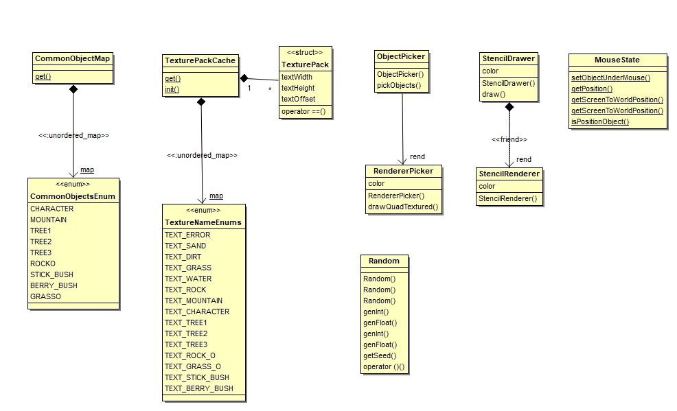

# Utilities Overview
The classes in Utilities are variously used throughout the game, however each have independent designs not specific to any other use cases or packages. These comprise of:  
  
1. [CommonObjectMap](#commonobjectmap-overview)  
2. [TexturePackCache](#texturepackcache-overview)  
3. [ObjectPicker](#objectpicker-overview)  
4. [StencilDrawer](#stencildrawer-overview)  
5. [MouseState](#mousestate-overview)  
6. [Random](#random-overview)  
  
  
*Classes which provide utility functions throughout*  
  
## CommonObjectMap Overview  
CommonObjectMap is a cache which stored pre-defined CommonObjectData instances against their respective enumerations in a map. This is a pure static class requiring no initialisation, all data members are static. On its first time being attained, initialization occurs which instantiates the map. All CommonObjectData instances are defined in its implementation.  

### Implementation  
[Nested class in GameObject.cpp](https://cseegit.essex.ac.uk/ce301_2020/ce301_allport_michael_s/-/blob/master/GameEngine/src/App/GameObject.cpp)  
[Nested class in GameObject.h](https://cseegit.essex.ac.uk/ce301_2020/ce301_allport_michael_s/-/blob/master/GameEngine/src/App/GameObject..h)  

### Main method identification  
**get(CommonObjectsEnum)** - Returns a CommonObjectData from its map.  

## TexturePackCache Overview  
TexturePackCache creates and stores associated TexturePacks defined within it's implemetations. TexturePacks store information about what texture is associated with a given TextureNameEnum, the Texture images size, the offsets that need applying to a quads geometry to have the image drawn centred in width and attaining the bottom of its origin. TexturePackCache stores the associated TexturePack to its corresponding enum. This pure static class to which external callers need only call its get method.  

### Implementation  
[TextureMap.cpp](https://cseegit.essex.ac.uk/ce301_2020/ce301_allport_michael_s/-/blob/master/GameEngine/src/App/TextureMap.cpp)  
[TextureMap.h](https://cseegit.essex.ac.uk/ce301_2020/ce301_allport_michael_s/-/blob/master/GameEngine/src/App/TextureMap.h)  

### Main method identification  
**get(TextureNameEnum)** - Returns associated TexturePack.  

## ObjectPicker Overview  
ObjectPicker's purpose is to assign an object under the mouse to the object reference in MouseState. It achieves this by taking a list of CommonGameObjects to render, associated their ObjectID's an encoded RGB colour as mentioned [47], and rendering each object to a hidden window. This makes use of a bespoke Renderer class for this purpose and set of shaders to render a texture in a set colour as opposed to its images pixel values. Openngl's glReadPixels is called to attain the colour of the pixel rendered under the mouses position. The colour is then decoded to obtain the object under the mouse, if there is one. The object reference is then set through MouseState methods.  
  
This cycle should be done each frame if the developer wishes to highlight objects under the mouse.

### Implementation  
[ObjectPicker.cpp](https://cseegit.essex.ac.uk/ce301_2020/ce301_allport_michael_s/-/blob/master/GameEngine/src/App/ObjectPicker.cpp)  
[ObjectPicker.h](https://cseegit.essex.ac.uk/ce301_2020/ce301_allport_michael_s/-/blob/master/GameEngine/src/App/ObjectPicker.h)  

### Main method identification  
**pickObjects(std::vector<CommonGameObject\*>\* objects)** - Takes as input the vector of objects to be picked from, and outputs nothing, just sets the object if there is one via MouseState class.  

## StencilDrawer Overview  
StencilDrawer's purpose is to provide a unique renderer such that the resultant object drawn is rendered with a shader increasing it's textures colour intensity. This is used within the WorldLayer's render cycle when rendering the object under the mouse, giving user visual feedback that an object is selected.

### Implementation  
[StencilDrawer.cpp](https://cseegit.essex.ac.uk/ce301_2020/ce301_allport_michael_s/-/blob/master/GameEngine/src/App/StencilDrawer.cpp)  
[StencilDrawer.h](https://cseegit.essex.ac.uk/ce301_2020/ce301_allport_michael_s/-/blob/master/GameEngine/src/App/StencilDrawer.h)  

### Main method identification  
**draw(CommonGameObject\*, glm::mat4 projection, GE::Graphics::RendererBatched& originalRenderer)** - This renderer ensures the begin() end() calls are made, and renderers the resultant object with highlighted colour.

## MouseState Overview  
MouseState's purpose is attaining mouse coordinates from the GameEngine, storing the object under the mouses position, and to convert mouse positions from a 2D position to world coordinate system pre transformations. The latter is achieved through Ray cast intersection with a plane as highlighted [1]. This makes use of the inverse projection matrix of a perspective matrix, and by assigning the mouse position's 2 coordinate vector a positive z direction, and normalizing the vector, the direction of the mouse can be attained. Dot products are then used to find the intersection.

### Implementation  
[MouseState.cpp](https://cseegit.essex.ac.uk/ce301_2020/ce301_allport_michael_s/-/blob/master/GameEngine/src/App/MouseState.cpp)  
[MouseState.h](https://cseegit.essex.ac.uk/ce301_2020/ce301_allport_michael_s/-/blob/master/GameEngine/src/App/MouseState..h)  

### Main method identification  
**setObjectUnderMouse(CommonGameObject\*)** - Sets the object under the mouse to input object.  
**getPosition()** - Attains the mouses 2D coordinates.
**getScreenToWorldPosition(Window&)** - Uses ray plane intersection to convert 2D mouse coordinates to world coordinates, enabling identification of where in relation to the game floor the user has clicked.  

## Random Overview  
Random uses C++ STL mt19973 mercenne twister library to generate random numbers. The instance can either be constructed with no args, giving a random seeded generator, or instantiated using a seed number. The class provides several functions for obtaining random numbers.  

### Implementation  
[Random.cpp](https://cseegit.essex.ac.uk/ce301_2020/ce301_allport_michael_s/-/blob/master/GameEngine/src/App/Random.cpp)  
[Random.h](https://cseegit.essex.ac.uk/ce301_2020/ce301_allport_michael_s/-/blob/master/GameEngine/src/App/Random.h)  

### Main method identification  
**getInt()** - Returns a random unsigned 32 bit integer in range 0 - 4294967295.  
**genInt(int, int)** - Returns a random integer between arg1 - arg2 range.  
**genFloat(float, float)** Returns a random float between range arg1 - arg2.  

# References
[47] "Picking with an OpenGL hack", Opengl-tutorial.org, 2021. [Online]. Available: http://www.opengl-tutorial.org/miscellaneous/clicking-on-objects/picking-with-an-opengl-hack/. [Accessed: 23- Apr- 2021].  
[1] https://antongerdelan.net/opengl/raycasting.html  
