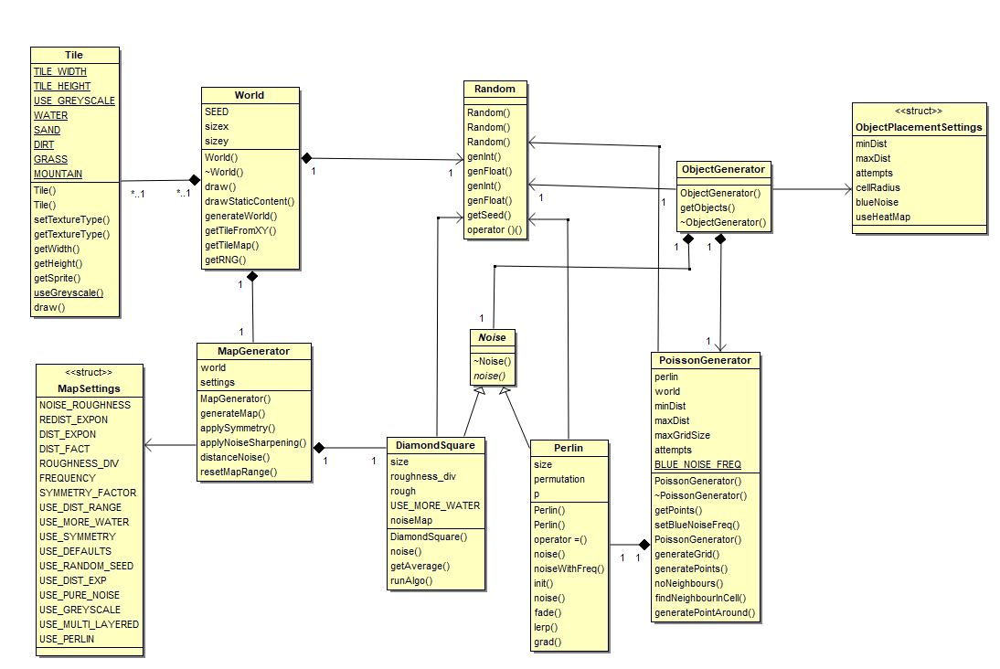

# World Generation Overview
The world generation subset of classes are solely responsible for creating the world and generating PCG content using Perlin noise, DiamondSquare noise, and Poisson Disk sampling methods. Main classes as follows:  
  
1. [World](#world-overview)  
2. [Noise Interface](#noise-interface-overview)  
3. [Perlin](#perlin-overview)  
4. [DiamondSquare](#diamondsquare-overview)  
5. [Map Generator](#map-generator-overview)  
6. [Object Generator](#object-generator-overview)  
7. [Poission Generator](#poisson-generator-overview)  
  
  
*Class diagram for main classes involved in world generation*  
  
## World Overview  
The World class is solely responsible for generating the tile-based representation of the world. It stores a local 2-Dimensional vector of Tile instances with each x, y position in the array relating to their world position such that position x = arr\[\]\[x\] * Tile::TILE_WIDTH (or height), and position z = arr[z][] * Tile::TILE_WIDTH.  
  
As well as the initialization of tiles, the world enacts the PCG representation of noise provided in a WorldGenerator instance by allocating tiles their 0-1 noise value. World also directs draw methods to the tiles, through use of its drawStaticContent.  This class also instantiates the RNG instance used throughout PCG methods ensuring the generator is seedable and can provide repeatable results for a given seed.  
  
### Implementation  
[World.cpp](https://cseegit.essex.ac.uk/ce301_2020/ce301_allport_michael_s/-/blob/master/GameEngine/src/App/WorldGeneration/World.cpp)  
[World.h](https://cseegit.essex.ac.uk/ce301_2020/ce301_allport_michael_s/-/blob/master/GameEngine/src/App/WorldGeneration/World.h)  
  
### Main method identification  
**drawStaticContent(GE:::Renderer)** - Main rendering method, called once upon the finalization of generated tiles such that static geometry is sent to the GPU bound memory once (given tiles never chnge).  
**generatorWorld(MapSettings)** - Generates the tile by creating WorldGenerator instance to attain noise map for the worlds size, resulting in setting each tiles type. This is to be called prior to drawStaticContent. Takes a MapSettings instance containing the parameters required for generation options.  
**getTileFromXY(int, int)** - Enables external classes to obtain a tile at a given position. This is mainly utilized in the ObjectGenerator/PoissonGenerator instance to ignore tiles who's values are associated with water, thereby decreasing the amount of processing required.  
**getRNG()** - Allows external classes to access the Random Number Generator to ensure seedable results.  
  
## Noise Interface Overview  
The noise interface exists such that any noise generator must override the noise(x, y) method for external classes to sample a noise value for a given 2-deminsional coordinate.  
  
### Implementation  
[Noise.cpp](https://cseegit.essex.ac.uk/ce301_2020/ce301_allport_michael_s/-/blob/master/GameEngine/src/App/WorldGeneration/Noise.cpp)  
[Noise.h](https://cseegit.essex.ac.uk/ce301_2020/ce301_allport_michael_s/-/blob/master/GameEngine/src/App/WorldGeneration/Noise.h)  

## Perlin Overview
Perlin noise gives a C++ adaptation transcribed from Ken Perlin’s Java implementation [57]. The only difference being is the permutation table. Instead of using the suggested pre-set table, we populate the table with values generated from the seeded RNG, ensuring repeatable results based upon our engine.  
  
### Implementation  
[Noise.cpp](https://cseegit.essex.ac.uk/ce301_2020/ce301_allport_michael_s/-/blob/master/GameEngine/src/App/WorldGeneration/Noise.cpp)  
[Noise.h](https://cseegit.essex.ac.uk/ce301_2020/ce301_allport_michael_s/-/blob/master/GameEngine/src/App/WorldGeneration/Noise.h)  
  
### Main method identification
**noise(int, int)** - Implements the Noise base class method to obtain noise.  
**noiseWithFrequency(int, int, int)** - The three arg Noise allows for parameterised frequency noise, giving the ability to generate high frequency blue noise or user defined frequency noise.  
  
## DiamondSquare Overview  
DiamondSquare is fBm form of noise, whereby a noise map is pre-generated using area subdivision first suggested in [21]. A 2-dimensional array of floats of size 2^n+1 is constructed. The corners are assigned a normalized random value. Centroid is located, and assigned the value of the average of the corners + a roughness value. Then the horizontal and vertical adjacent elements are applied the same, using two corners and the centroid for the average. The area is then subdivided, the roughness value divided by an amount usually half, and steps repeated until all elements of the array have noise values. Higher division amounts of roughness see a smoother gradient of noise, whilst lower see more stochastic characterises. 
  
This algorithm has been taken from its abstract concept and implemented from new.  
  
### Implementation
[Noise.cpp](https://cseegit.essex.ac.uk/ce301_2020/ce301_allport_michael_s/-/blob/master/GameEngine/src/App/WorldGeneration/Noise.cpp)  
[Noise.h](https://cseegit.essex.ac.uk/ce301_2020/ce301_allport_michael_s/-/blob/master/GameEngine/src/App/WorldGeneration/Noise.h)  
  
### Main method identification
**runAlgo(float)** - Is the main implementation to populate the array with the noise.  
**noise(int, int)** - Implements base Noise class, whilst also provided an array wrap such that is a user were to give negative coordinate as argument, or a coordinate outside the size of the array of generated noise, a mirrored value is obtained.  
  
## Map Generator Overview  
Map generator is the main class responsible for generating the noise to produce terrain in the world. It has been parameterized using MapSettings class such that users have full control over the resultant noise. Users can select which Seed to use in the RNG, whether to use Perlin or DiamondSquare noise, and which post processing techniques are to be made as detailed [22] with their respective parameters. Parameters available:  
  
1. Perlin - Frequency, adjusting the frequency of the noise in Perlin method only.  
2. USE_PURE_NOISE - unadulterated noise used, no following options apply if true.  
3. APPLY_SYMMETRY - if true, uses applySymmetry function on the noise as described below. 
4. REDIST_EXPON - this is always applied. It is the parameter of noise redistribution as described in applyNoiseSharpening below.  
5. USE_DIST_RANGE - if true, applies distanceNoise function described below.  
6. USE_DIST_EXP - if true applies a second distanceNoise function of value DIST_EXPON post distance function.
7. DiamonSquare - NOISE_ROUGH_DIV, the rate at which to divide the roughness factor added to during diamond and square steps. Higher values lead to more stochastic noise, lower a smoother gradient. 
  
### Implementation  
[MapGenerator.cpp](https://cseegit.essex.ac.uk/ce301_2020/ce301_allport_michael_s/-/blob/master/GameEngine/src/App/WorldGeneration/MapGenerator.cpp)  
[MapGenerator.h](https://cseegit.essex.ac.uk/ce301_2020/ce301_allport_michael_s/-/blob/master/GameEngine/src/App/WorldGeneration/MapGenerator.h)  
  
### Main method identification
**generateMap()** - This is the main method for creating and returning a noise map. Logic pertains to checking which parameters are set in the MapSettings instance.  
**resetMapRange(std::vector<std::vector<float>>>)** - Utilized upon each post processing method, this remaps all noise values to be in range 0-1 with lowest noise value found mapped to 0 and maximum found mapped to 1.  
**applySymmetry(std::vector<std::vector<float>>>, Noise\*)** - This increases/decreases a given x, y noise value by taking a sample at 0.5 * noise(x * 2) and 0.25 * noise(x*4), where the x multiplier has been parameterised to SYMMETRY_FACTOR. This applies a form of noise smoothing when using Perlin noise, and a mirroring effect when using DiamonSquare due to the implementation of noise generation.  
**applyNoiseSharpening(std::vector<std::vector<float>>>, int)** - This raises the noise at position x,y to the power of input int.  
**distanceNoise(std::vector<std::vector<float>>>)** - applies a distance function using Euclidean distance, raising noise values closer to the centre of the map and lowering values closer to the edge.  
  
## Object Generator Overview  
ObjectGenerator is a stochastic method that associates a set of points generated by Poisson Generator with a respective object type. This class utilizes Perlin Noise such that points with a higher noise value have an increased probability of generating a tree. There is an 80% probability of generating an item for a given point. If a random is generated within 80%, then a further random is generated. If the further random is less than the noise value a tree is placed, else if it is less than 1 - noise grass is generated, else a miscellaneous object is generated. At each step a chance of generating an additional consumable object is applied.  
  
Objects are stored locally in a vector and external classes can obtain them.  
  
### Implementation  
[ObjectGenerator.cpp](https://cseegit.essex.ac.uk/ce301_2020/ce301_allport_michael_s/-/blob/master/GameEngine/src/App/WorldGeneration/ObjectGenerator.cpp)  
[ObjectGenerator.h](https://cseegit.essex.ac.uk/ce301_2020/ce301_allport_michael_s/-/blob/master/GameEngine/src/App/WorldGeneration/ObjectGenerator.h)  
  
### Main method identification
**generateObjects()** - Main initialization method to generate the local map. Applies algorithm described in overview.  
**addConsumable(Vector2D)** - Attempts 20 times to place consumable objects around a given point using PoissonGenerator furthermore.  

*Following methods all return CommonGameObjects for associated enum type*
**genTree(Vector2D)** - Returns a TREE for a point.  
**genGrass(Vector2D)** - Returns a GRASS for a point.  
**genMisc(Vector2D)** - 50% probability of returning a STICK_BUSH, 50% returning a BERRY_BUSH.  
**genConsumable(Vector2D** - 33.33% probability returning a ROCKO, 66.66% returning a GRASSO.  

## Poisson Generator Overview
Poisson sampling is a method described [25]. This is a method of generating numerous points whereby no 2 points are within a minimum distance. This is done by using a simple radius collision check between points in all neighbouring regions, or cells in this case. We use a parameterised function allowing for 'float minDist, float maxDist, and int attempts' to be set through constructor. The minimum distance is as says, the minimum distance two points can be apart. We however use a variable density sampling method, whereby points of random distance between minDist and (1 - noise(x, y)) \* maxDist is used utilizing Perlin noise to govern this.  
  
This class makes use of a basic Grid class, which maintains a 2-Dimensional vector of cells each with size maxDist. The grid class has member functions for obtaining neighbours in adjacent cells, placing points in cells, and determining if a point can exist in the grid.  
  
### Implementation  
[PoissonGenerator.cpp](https://cseegit.essex.ac.uk/ce301_2020/ce301_allport_michael_s/-/blob/master/GameEngine/src/App/WorldGeneration/PoissonGenerator.cpp)  
[PoissonGenerator.h](https://cseegit.essex.ac.uk/ce301_2020/ce301_allport_michael_s/-/blob/master/GameEngine/src/App/WorldGeneration/PoissonGenerator.h)  
  
### Main method identification  
**getPoints()** - Calls private member generatePoints() to run the algorithm, constructing a Grid of points. Then constructs a vector of these, and returns to user, where points are Vector2D type.  
  
More details on algorithm found on all PCG algorithms are in the final report.

# References
[57] K. Perlin, "Improved Noise reference implementation", Mrl.cs.nyu.edu, 2021. [Online]. Available: https://mrl.cs.nyu.edu/~perlin/noise/. [Accessed: 28- Apr- 2021].  
[21] A. Fournier, D. Fussell and L. Carpenter, "Computer rendering of stochastic models", Communications of the ACM, vol. 25, no. 6, pp. 371-384, 1982. Available: 10.1145/358523.358553  
[22] A. Patel, 2021. [Online]. Available: https://www.redblobgames.com/maps/terrain-from-noise/. [Accessed: 21- Apr- 2021].  
[25] N. Dwork, C. Baron, E. Johnson, D. O'Connor, J. Pauly and P. Larson, "Fast variable density Poisson-disc sample generation with directional variation for compressed sensing in MRI", Magnetic Resonance Imaging, vol. 77, pp. 186-193, 2021. Available: 10.1016/j.mri.2020.11.012  
