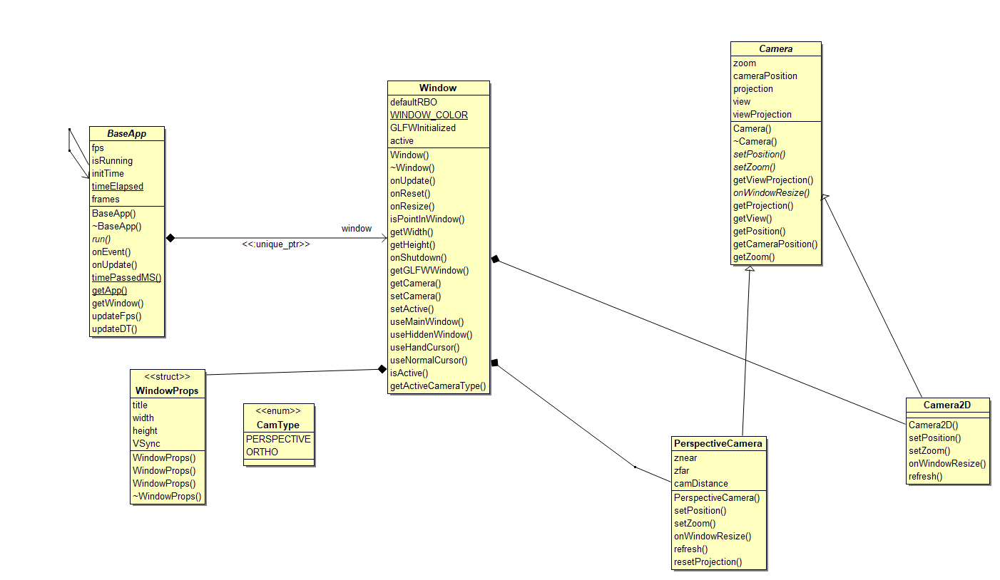

# Application Class Overview's  
The application suite contains three main classes:  
  
1. [BaseApp](#BaseApp)  
2. [Window](#Window)  
3. [Camera](#Camera)   
	3.1 PerspectiveCamera  
	3.2 OrthographicCamera
  
  
Class diagram

All applications wishing to use the GameEngine is to extend BaseApp class and call onUpdate() each frame.  
  
## BaseApp class overview 
Baseapp is the entry point for any application wishing to use the Game Engine. Its sole responsibility is creating the window context, and providing an onUpdate() method. This updates the time passed between frames and subsequently calls Window::onUpdate() to swap buffers displaying all rendered graphics. Main applications should extend this class, and call BaseApp::onUpdate() at the end of each frame.  

It is intended that there will only ever be one instance of a BaseApp, and as such static methods for accessing the BaseApp instance is offered through static getApp() method. Designing the class this way allows dynamic access of the application and its window member.

BaseApp also implements the EventHandler interface overriding the onEvent function. This actions WindowClose events and WindowResize events, turning member boolean 'isRunning' to false when the window is closed and calling window's onWindowResize() method respectively. This enables applications to use 'isRunning' in the game loop to identify when the application is closed.

### Implementation   
[BaseApp.h](https://cseegit.essex.ac.uk/ce301_2020/ce301_allport_michael_s/-/blob/master/GameEngine/src/GE/BaseApp.h)  
[BaseApp.cpp](https://cseegit.essex.ac.uk/ce301_2020/ce301_allport_michael_s/-/blob/master/GameEngine/src/GE/BaseApp.cpp)  
  
### Main methods identification  
**onUpdate()** is the main usage of this class, in turn calls the windows onUpdate, updateDT(), and updateFps(). Its main purpose is to update the timePassed variable for its getters.  
**getWindow()** returns the window for external access.  

## Window class overview 
The window class instantiates GLFW [1] window contexts, which provide OpenGL a context to render graphics unto. Two window contexts are provided: window and hiddenWindow, with the latter providing a means to render behind the scenes. Users may switch OpenGL contexts with useMainWindow() and useHiddenWindow() methods. GLFW also provides call-back functionality to respond to user input, which is the main invocation of the event subsystem. When an event is polled, the event associated to the input is created and published through the GE::Event transmitter. GE::Window initializes these event callbacks.  

It's main purpose to external classes is to provide getter functions for the active camera, enabling the user to obtain view, projection, and viewProjection matrices used in OpenGL's shaders.

### Implementation
[Window.cpp](https://cseegit.essex.ac.uk/ce301_2020/ce301_allport_michael_s/-/blob/master/GameEngine/src/GE/Window.cpp)  
[Window.h](https://cseegit.essex.ac.uk/ce301_2020/ce301_allport_michael_s/-/blob/master/GameEngine/src/GE/Window.h)  
  
### Main methods identification
**initWindow(int ID)** is the main function to initialise glfw windows, this is called on Window's construction.  
**initCallBacks()** is the main function to publish events used in the EventTransmitter class.  
**setCamera(GE::CamType)** is used to change the active camera type, to be used when switching between perspective and orthographic camera.  
**bool isPointInWindow(int x, int y)** is used to determine if x and y positions are within the windows area.
  
## Camera class overview 
Camera class provides functionality for attaining view, projection, and viewProjection matrices. Derived classes must implement setPosition(), setZoom(), refresh(), and onWindowResize() methods for their respective projections. The intention is that refresh() would update the view, projection, and viewProjection matrices for the type of projection given.  
  
Two derived cameras are available: Perspective Camera and Orthographic Camera providing both perspective and orthographic projections respectively. These matrices transform 3D cartesian vectors from one vector space to another. The view matrix is used to transform an objects model coordinates to view space, such that if the camera is centred about 0,0,0 and an object exists at 600,0,0 with its model centred about 0,0,0, a translation of 600 in the x axis is performed on the object. While the projection matrix converts coordinate space into Normalized Device Coordinates, x = -1, 1 y = -1, 1 z = -1, 1.
  
### Implementation  
[Camera.cpp](https://cseegit.essex.ac.uk/ce301_2020/ce301_allport_michael_s/-/blob/master/GameEngine/src/GE/Camera.cpp)
[Camera.h](https://cseegit.essex.ac.uk/ce301_2020/ce301_allport_michael_s/-/blob/master/GameEngine/src/GE/Camera.h)

### Main methods identification  
**refresh()** - to update view, projection, and viewProjection matrices.  
**setPosition(const glm::vec3 position)** - sets the position of the camera in world space.  
**setZoom(float zoom)** - sets the zooom of the camera.  
**getProjection(), getView(), getViewProjection()** - are the main getters to attaining. transformation matrices  
