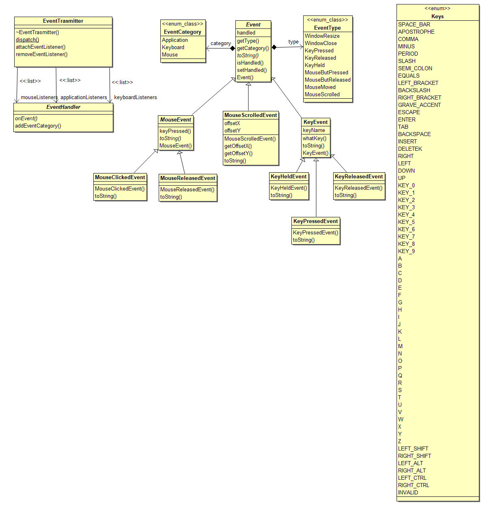

# Event Subsystem Overview
The event system contains two main logical classes, the EventTransmitter which is used to subscribe and publish events, and the Events and derived classes identifying the event types. Due to the numerous event types and derived class, this documentation will only detail the Event base class, as all derived classes contain common sense members. All classes wishing to subscribe to events must realise the EventHandler interface implementing the onEvent pure virtual method. 

1. [EventTransmitter](#eventtransmitter-overview)
2. [EventHandler](#eventhandler-overview)
3. [Event](#event-overview)
  
  
*Class Diagram*

## EventTransmitter Overview  
The EventTransmitter class is a singleton design using the publisher/subscriber pattern. The static methods dispatch() allows for transmitting an event, whilst attachEventListener and removeEventListener is used within the EventHandler class to subscribe to events. EventHandler stores lists of all EventListeners for their associated categories to which they have requested events to be published. Events are filtered by their categories and sent to all listeners in the associated listers list.
  
### Implementation  
[EventHandler.cpp](https://cseegit.essex.ac.uk/ce301_2020/ce301_allport_michael_s/-/blob/master/GameEngine/src/GE/Events/EventHandler.cpp)  
[EventHandler.h](https://cseegit.essex.ac.uk/ce301_2020/ce301_allport_michael_s/-/blob/master/GameEngine/src/GE/Events/EventHandler.cpp)  
  
### Main method identification  
**dispatch(Event)** - This is the main method for dispatching an event. The event's category is checked, and dependant upon the category the associated EventListeners receive the event.  
**attachEventListener(EventHandler&, EventCategory)** - This method is called via EventHandler when registering an event listener. The listener is added to the list associated with the category argument.  
  
## EventHandler Overview
The EventHandler class is a pure virtual interface requiring derived classes to realise the onEvent() method, thereby applying any class specific logic to respond to the event. EventHandler provides implementation for the addEventCategory function, calling the EventTransmitter to register for the event category provided.  
  
### Implementation
[Nested class within EventHandler.cpp](https://cseegit.essex.ac.uk/ce301_2020/ce301_allport_michael_s/-/blob/master/GameEngine/src/GE/Events/EventHandler.cpp)  
[Nested class within EventHandler.h](https://cseegit.essex.ac.uk/ce301_2020/ce301_allport_michael_s/-/blob/master/GameEngine/src/GE/Events/EventHandler.cpp)  
  
### Main method identification
**onEvent(Event) *Pure Virtual*** - This method requires derived classes to realise, applying any class specific logic to respond to an event.
**addEventCategory(EventCategory)** - Attached an EventListener to the EventTransmitter.

## Event Overview
The Event class contains two main members, category and type which available through getters. These use the EventCategory enum class and EventType enum class respectively. This allows for events to be identified and dynamically bound to their associated derived classes.  
  
Derrived classes include: KeyEvent, MouseEvent, MouseScrolledEvent, and further derived classes dependant upon if key is pressed, released or held. All keys have been enumerated to the Keys enum class, allowing for identification of which key has been pressed. Derived classes provide members to attain the key that has been pressed. Derived classes assign their respective category and type within their constructors. Any publisher is expected to construct the correct event class when an event is made.  
  
### Implementation  
[Event.cpp](https://cseegit.essex.ac.uk/ce301_2020/ce301_allport_michael_s/-/blob/master/GameEngine/src/GE/Events/Event.cpp)  
[Event.h](https://cseegit.essex.ac.uk/ce301_2020/ce301_allport_michael_s/-/blob/master/GameEngine/src/GE/Events/Event.h)  
[Key Events Directory](https://github.com/MikeAllport/CE301-Final-Year-Project/tree/main/GameEngine/src/GE/Events/Keys)  
[Mouse Events Directory](https://github.com/MikeAllport/CE301-Final-Year-Project/tree/main/GameEngine/src/GE/Events/Mouse)  
[Window Events Directory](https://github.com/MikeAllport/CE301-Final-Year-Project/tree/main/GameEngine/src/GE/Events/Window)  
  
### Main method identification  
**getType()** - Returns the EventType enum of an event.  
**getCategory()** Returns the EventCategory enum of an event.  
