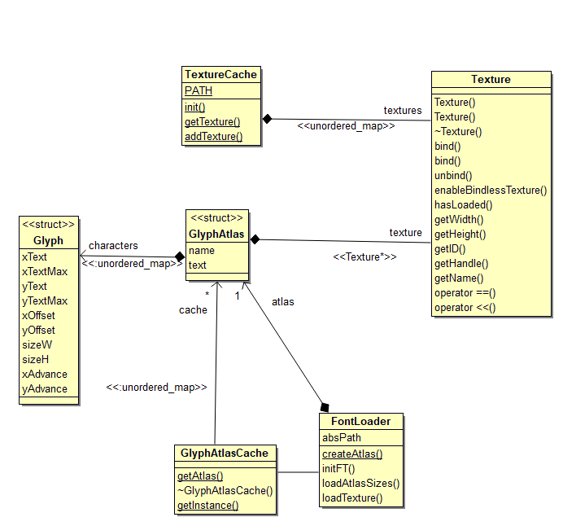
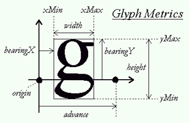

# Assets Overview  
The assets section of the Game Engine incorporates classes whose responsibility it is to load Textures to GPU memory, store reference pointers to their GPU ID's, and conform to caching classes. Classes involved are as follows:

1. [Texture](#Texture)  
2. [TextureCache](#TextureCache) 
3. [FontLoader](#FontLoader)   
4. [Glyph](#Glyph)  
5. [GlyphAtlas](#GlyphAtlas)  
6. [GlyphAtlasCache](#GlyphAtlasCache)  
  

Texture and Texturecache are the main image loading classes. Whilst Glyph, GlyphAtlas, GlyphAtlasCache, and FontLoader are all related to the FontRender, to which a GlyphAtlas stores a font in a Texture instance.  
  
FontLoader is the main class in which fonts are loaded enabling the creation of Glyphs, GlyphAtlases. FontLoader utilizes the FreeType library, and creates a Texture atlas of all ascii characters related to a font. The Texture atlas in a sequence of character images existing on one line stored in GPU memory.
  
Cache classes merely contain mapping to attain the respective Texture or GlyphAtlas instances. Font rendering methods and related asset classes are adapted from [1].  
  
## Texture Overview 
Texture class is the main class responsible for sending an raw image file using OpenGL methods to GPU memory. The class has two constructors. 

1. The first constructor takes a std::string filename as it's argument, and given the static classes std::string path variable loads the file from directory '{compiledDIR}/path/filename'. This constructor uses stb_image library to load the raw image data in format 'unsigned char\*' and send the data to OpenGL via glad library.  
2. The second constructor does no loading of image data, but merely allocates a texture handle on OpenGL for use. External classes, mainly FontLoader, can then upload raw image data themselves and specify the texture buffer's size.  
  
In all instances, the handle identifying the instances texture in GPU memory is allocated to the member 'textID'. This id can then be used to bind a texture during a draw call in GE::Renderer class.

### Implementation  
[Texture.cpp](https://cseegit.essex.ac.uk/ce301_2020/ce301_allport_michael_s/-/blob/master/GameEngine/src/GE/Graphics/Texture.cpp)  
[Texture.h](https://cseegit.essex.ac.uk/ce301_2020/ce301_allport_michael_s/-/blob/master/GameEngine/src/GE/Graphics/Texture.h)  

### Main method identification  
**bind()** - binds texture to be the default OpenGL 'sampler2D' texture used in a fragment shader.  
**bind(int slot)** - binds the texture to a dynamic array address, used in OpenGL's sampler2D arrays (when more than one texture is to be bound).  
  
## TextureCache Overview   
TextureCache is a static singleton class, only one instance is created at run-time. This class is mainly responsible for loading textures through the getTexture() method. It achieves this by mapping a loaded Texture to its associated filename, if the Texture does not exist in it's directory, then a new Texture is created and added to the map. This class also provides an initialisation function which recursively opens all files of types listed in its local static member 'FILE_TYPES' (Only png files have been tested, but jpgs and other common files should work). Separate member function addTexture has also been added for external classes to assign textures to the map, mainly used in FontLoader.  

### Implementation  
[TextureCache.cpp](https://cseegit.essex.ac.uk/ce301_2020/ce301_allport_michael_s/-/blob/master/GameEngine/src/GE/Graphics/TextureCache.cpp)  
[TextureCache.h](https://cseegit.essex.ac.uk/ce301_2020/ce301_allport_michael_s/-/blob/master/GameEngine/src/GE/Graphics/TextureCache.h)  

### Main method identification  
**init(std::string path)** - when this method is called with a filepath, relative to {CompileDIR}, all files are recursively scanned and their extensions are checked against acceptable extension in member 'FILE_TYPES'. If the file is of correct type, then getTexture is called to load the texture in the map.  
**getTexture(std::string name)** - this is the main method for attaining a texture. If a texture with the name does not exist in the 'textures' map member, then a new Texture is created. The Texture associated to the name is returned.  
**addTexture(std::string name, std::shared_ptr<Texture> texture)** - This adds a Texture to the map, returning true if added or false otherwise.

## FontLoader Overview
Font loader is the sole class responsible for parsing a '.ttf' FreeType font file and creating a GlyphAtlas representation of the font, whilst also creating a Texture in GPU memory for a texture atlas. This class is heavily adapted from [1], where instead of creating a Texture for every character leading to endless draw calls, one single row texture atlas is made containing every character and their offsets/dimensions into the texture. 
  
### Implementation  
[FontLoader.cpp](https://cseegit.essex.ac.uk/ce301_2020/ce301_allport_michael_s/-/blob/master/GameEngine/src/GE/Graphics/FontLoader.cpp)  
[FontLoader.h](https://cseegit.essex.ac.uk/ce301_2020/ce301_allport_michael_s/-/blob/master/GameEngine/src/GE/Graphics/FontLoader.h)  
  
### Main method identification
**createAtlas(const char\* fp, const char\*fn)** - This is the sole public method for creating and returning a GlyphAtlas. It does so by creating a FontLoader instance, which in turn calls initFT(), loadAtlasSizes(), and loadTexture() methods.  
**initFT()** - Associates an FT_Face instance *face* using the FreeType library using the filepath and filename created in *createAtlas*. If no such fft font file exists, or there is an error loading the FT_Face, the program outputs error message and exists.  
**loadAtlasSizes()** - This method mainly loops over every ascii character from 32-128 (printable characters) to obtain a textures maximum width and maximum height - required when storing data in OpenGL buffers.  
**loadTexture()** - This is mainly responsible for creating Glyph instances for each ascii character in the font file to store in the GlyphAtlas. This method also creates a Texture being a single row image of all characters stored in GPU memory.  

## Glyph Overview   
Glyph is a basic struct class that represents a single character loaded through FreeType library, pertaining to the information detailed in Fig1. All characters are to be drawn based around point *origin*. The main difference in representation is instead of storing bearingY, offsetY is = (height - bearingY) and bearingX, offsetX = (width - bearingX); such that it is known how much to raise and move horizontally. *advance* specifies how much to move to obtain the next characters start position.  
  

*Glyph metrics [1]*  

## GlyphAtlas Overview  
GlyphAtlas is another struct class containing the map of ascii characters with their associated Glyph instances such that each character has all information needed to position itself. This struct also contains the Texture atlas of all the character images, its width, height, and font size.  
  
## GlyphAtlasCache Overview  
GlyphAtlasCache is the main storage cache of GlyphAtlases. This is a static singleton design, there is one instance created at runtime. getAtlas is the main method which either returns a loaded GlyphAtlas in its associated map or instantiates a FontLoader instance to create a GlyphAtlas to store in its map.  

### Implementation  
[Nested class within FontLoader.cpp](https://cseegit.essex.ac.uk/ce301_2020/ce301_allport_michael_s/-/blob/master/GameEngine/src/GE/Graphics/FontLoader.cpp)  
[Nexted class within FontLoader.h](https://cseegit.essex.ac.uk/ce301_2020/ce301_allport_michael_s/-/blob/master/GameEngine/src/GE/Graphics/FontLoader.h)  
  
### Main method identification  
**getAtlas(const char\* fp, const char\*fn)** - This method takes as input the file path char array and the filename char array. If there does not exist a GlyphAtlas in its 'cache' associated to the filename, FontLoader's createAtlas method is called to create a GlyphAtlas. The associated atlas is returned containing all information required to render text from the font file.  

# References  
[1] https://learnopengl.com/In-Practice/Text-Rendering  
