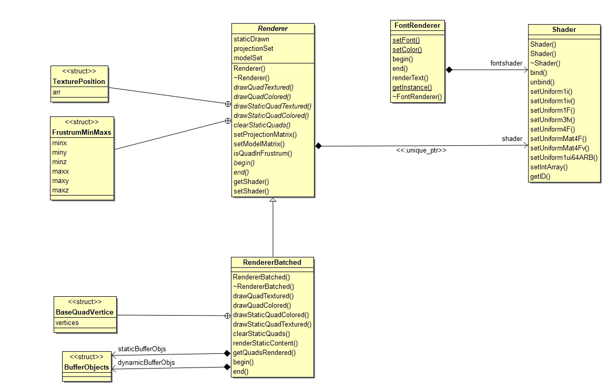
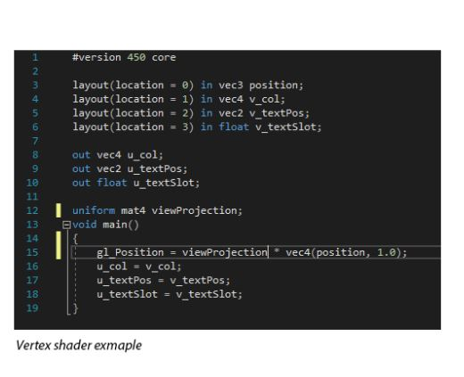
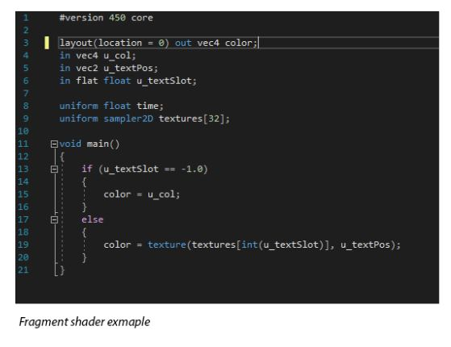

# Renderers overview
The engine comes with two types of renderers, BatchedRender for main graphics rendering, and a FontRender for rendering of text. Both renderer types utilize the Shader class, which comprises of a fragment shader and vertex shader. These are GPU bound programs that are run via OpenGL. The vertex shaders perform all per vertex transformations in the view and projection coordinate space. Whilst the fragment shader performs per pixel operations, determining the resultant pixel attributes. Both classes make use of the Texture class under Assets where rendering images are concerned.  
  
1. [Renderer/RendererBatched](#renderer-overview)  
2. [FontRender](#FontRenderer)  
3. [Shader](#Shader)  
  
  
*Class Diagram*  
  
## Renderer Overview 
The Renderer abstract class mainly defines methods pertaining to setting the Projection and Model matrices between frames and object draws respectively. Whilst the derived class, BatchedRenderer, provides implementation for the various drawQuad methods, and initiation and end of a draw call through begin() and end() methods. Upon setting projection and setting model booleans projectionSet and modelSet are set to true. Derived classes can use these to ensure the developer has properly followed the rendering process as expected.    
  
The base Renderer class also provides the ability to check in a quad is within the viewing frustrum of the resultant screen. This is achieved by construction an AABB box of the viewing frustrum using the inverse projection matrix for the frustrums 8 corners. The AABB box is constructed upon each setProjection call, and then for any call to isQuadInFrustrum() an AABB collision check is made to determine if the quad is within the frustrum.  
  
Renderer's constructor takes as argument the std::string of vertex and fragment shaders, which should be located in {Compilation Directory}/res/shaders folder. If loading of shaders fail, an error message detailing why is output to console and the program exits.  
  
### RendererBatched overview
Upon construction OpenGL vertex buffers, index buffers, and vertex layouts are created GPU bound and a reference of these are stored in BufferObjects struct. There are two types of GPU buffer sets made, static sets which may contain 1 or more BufferObjects depending on how many static quads are set by external classes, and a single dynamic set.  
  
When drawStaticQuad methods are called, the vertex information for the quad is stored in a cache and their information are sent to the GPU once - unless more static quads are added between draw calls to which a further sending of buffer data will be done. drawDynamicQuad methods are to be called between a render cycles begin() and end() method for each dynamic object. The dynamic quads are stored in a cache, and when either the frame ends with the end() method or 10,000 quads are reached a flush will occur whereby all vertex information is send to the active dynamic buffer and a draw call made, rendering all quads to screen.  
  
On each drawQuad call, the model transformation is applied to the BaseQuadVertice class - in which a 1x1x1 quad is stored centred about 0,0,0. Any scaling, rotating, or translating in the model matrix is performed with the 0,0,0 point of origin.  
  
Additionally, each drawQuad method checks the developer has set the model matrix as intended. the final render called through end() method also checks if the projection has been set as intended. If neither are true, an error message is logged to console and the render of quad or render cycle is cancelled respectively.  

### Implementation
[Renderer.cpp](https://cseegit.essex.ac.uk/ce301_2020/ce301_allport_michael_s/-/blob/master/GameEngine/src/GE/Graphics/Renderer.cpp)  
[Renderer.h](https://cseegit.essex.ac.uk/ce301_2020/ce301_allport_michael_s/-/blob/master/GameEngine/src/GE/Graphics/Renderer.h)  
  
### Main method identification
**Renderer::setProjectionMatrix(glm::mat4)** - Sets the projection matrix, required to be done during render cycle between begin() and end() calls.    
**Renderer::setModelMatrix(glm::mat4)** - Sets the respective quads model matrix, required to be done before a drawQuad method.  
**Renderer::isQuadInFrustrum(int x, int y, int z, int sizex, int sizey, int sizez)** - Returns a boolean indicating whether a quad with the input parameter characteristics are in the view spectrum.  
  
**RendererBatched::drawQuad** provides 4 methods, two static, two dynamic, and one Textured and one Colored for both respectively.  
**RendererBatched::drawQuad*x*Colored(glm::vec4**) - provides the methods to draw a quad of a filled colour, where *x* denotes Static or Dynamic. These methods take a glm::vec4 representation of the colour in 0-255 range for rgb, an alpha in 0-1 range  
**RendererBatched::drawQuad*x*Textured(Texture)** - provides the methods to draw a quad with a textured background, where *x* denotes Static or Dynamic. These method take a Texture pointer for the desired texture. Textures are stored in a map and assigned an ID, which is sent to the vertex buffer for rendering.  
  
## FontRenderer 
Font rendering methods and related asset classes are adapted from [1]. FontRenderer draws upon the same design as Renderer class, however this is a more simplified version. All characters of a text are rendered as individual quads, utilizing the GE::GlyphAtlas class which stores all information about a character's size, offsets, texture positions etc to construct the quads vertices in the renderText method. There are no projection matrices applied in this renderer, meaning all text must exist in the NDC -1 to 1 x, y, z coordinate system.  
  
The same render cycle applies as Renderer. begin() must be called to initiate drawing, renderText() called for all text required drawing, and end() called for data to be sent to GPU and draw call made.  
  
FontRenderer has a state machine design, setFont and setColor must be called before any render cycle, or during. Classes in FontLoader part of Assets are responsible for providing the Glyphatlas instances required.

### Implementation
[FontRenderer.cpp](https://cseegit.essex.ac.uk/ce301_2020/ce301_allport_michael_s/-/blob/master/GameEngine/src/GE/Graphics/FontRenderer.cpp)
[FontRenderer.h] (https://cseegit.essex.ac.uk/ce301_2020/ce301_allport_michael_s/-/blob/master/GameEngine/src/GE/Graphics/FontRenderer.h)

### Main method identification
**setFont(const char\* fp, const char\* fn)** - Required to be called prior to any font rendering, with file path and file name given for parameters associated to {Build Path} directory. This calls GE::FontLoader class which in turn loads/caches a GlyphAtlas instances.  
**setColor(glm::vec)** - sets the colour for the resultant text to appear.  
**begin() end()** - initiates and finalizes render cycle respectively.  
**renderText(const char\* text, float x, float y, float scale)** - the main call to be made between begin() and end() for rendering text. Takes the text, x position, y position, and scale size in relation to font height as parameters.  

## Shader 
The shader class is responsible for the loading of vertex and fragment shaders from source files and uploading/compiling them on the GPU via OpenGL methods. This class also provides several methods for uploading uniforms - a block of data stored in GPU memory associated to the shader. By giving the facility to send data for the shader, the shader programs read and manipulate the data as inputs. This allows for shaders to have access to the projection/view matrices, colours, texture slots, lighting information etc.  
  
### Vertex Shader  
  
  
*Fig1, Vertex shader example*  
  
A basic vertex shader example is provided in Fig1. The first block of code, lines 3-6, reference the per vertex information stored in the bound buffer (buffer objects made in [RendererBatched](#Renderer/RendererBatched) implementation). In this example the first 3 floats are associated to the vertex's position, next 4 floats the vertex's colour, next 2 floats the vertex's texture position, and next float the vertex's texture slot. The next block of code, lines 8-10, specify the outputs that are then sent to the fragment shader, namely being the colour, texture position, and texture slot. A uniform is bound, meaning that every render cycle the user must use the associated Shader class method to send a mat4 uniform with the name "viewProjection" to the shader - line 12. The GPU then transforms the homogenous position coordinates by the ViewProjection matrix - line 15. Finally lines 16-18 output the vertex's attributes to the fragment shader.  

### Fragment Shader  
  
  
*Fig2, Fragment shader example*  
  
A basic fragment shader example is provided in Fig2. The first line indicates the output of the fragment shader is a vec4 colour which will output. This colour is then interpolated by the GPU between each vertex. If the output is a texture, the textures pixels is interpolated over the distance between positions. If the output is a colour, the colour between vertexes will be interpolated between positions. Lines 4-6 specify what inputs are given from the vertex shader. Lines 8-9 specify uniforms input from the Shader class. This is a very  simple program, if the 'u_textSlot' is -1, then the output colour is to be the 4 component vec4 color associated with a vertex. Else, the 'u_textSlot' variable is an index into the bound sampler2D texture array on line 9, and the fragment shader's output is to be a texture.  
  
For more complex games, more complex shaders are required. For instance, fragment shaders are used to apply lighting to a scene. The resultant output colour is a product of a light sources colour and the intensity given it's distance. Certain shaders may be used for different purposes, such as shaders used for water and their reflections/appearance. These examples and those used in the game presented are basic.  
  
### Implementation 
[Shader.cpp](https://cseegit.essex.ac.uk/ce301_2020/ce301_allport_michael_s/-/blob/master/GameEngine/src/GE/Graphics/Shader.cpp)  
[Shader.h](https://cseegit.essex.ac.uk/ce301_2020/ce301_allport_michael_s/-/blob/master/GameEngine/src/GE/Graphics/Shader.h)  
  
## Main method identification  
**bind()** - this sets the selected shader program, fragment and vertex combination, as the active shader. [RendererBatched](#Renderer/RendererBatched) calls this on each draw call.  
**setUniform*x*** - these corresponding methods send data to the shader instance, where *x* denotes the type of data being sent. Many of these methods have been used during the duration of the products lifecycle, however unltimated only setUniformMat4fv is used sending the projection matrix to the shader. All methods take the data, or a pointer to the data, alongside the uniform’s handle/name string.  
  
# References  
[1] https://learnopengl.com/In-Practice/Text-Rendering
