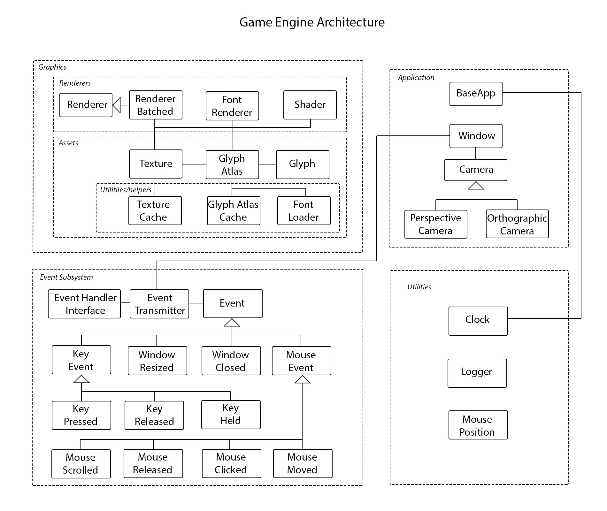
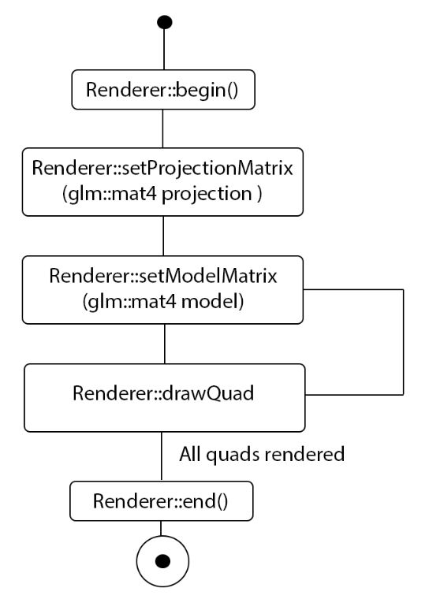

# Game Engine design overview
The overall design of the game engine draws inspirations from open-source projects Hazel Engine [5], Ethereal Engine [6], and OpenGL C++ tutorials [7]. While the overall abstract structure reflects different parts from all, mainly [5], direct implementations are original, unless stated in associated subpages (Logging).  
  
Subsystems can be split into the following categories:  
  
1. Graphics  
	1.1 [Renderers](https://github.com/MikeAllport/CE301-Final-Year-Project/tree/main/TechnicalDocumentation/GameEngine/Graphics/Renderers)  
&nbsp;&nbsp;&nbsp;&nbsp;&nbsp;&nbsp;&nbsp;&nbsp;1.1.1 Renderer/BatchedRenderer  
&nbsp;&nbsp;&nbsp;&nbsp;&nbsp;&nbsp;&nbsp;&nbsp;1.1.2 FontRenderer  
&nbsp;&nbsp;&nbsp;&nbsp;&nbsp;&nbsp;&nbsp;&nbsp;1.1.3 Shader  
	1.2 [Assets](https://github.com/MikeAllport/CE301-Final-Year-Project/tree/main/TechnicalDocumentation/GameEngine/Graphics/Assets)  
2. [Application](https://github.com/MikeAllport/CE301-Final-Year-Project/tree/main/TechnicalDocumentation/GameEngine/Application)  
3. Event subsystem  
4. Utilities  
	
  
*Fig 1, game engine architecture*
  
## Application
This subsystem provides creation of the window context upon which OpenGL renders graphics unto. Main applications using the Game Engine are required to extend GE::BaseApp class to have the window instantiated. This base class also contains member functions/variables for recording the time passed during each frame. As such, GE::BaseApp::onUpdate() must be called at the end of each frame to use this feature.

GE::BaseApp gives access to it's window member, containing information regarding the window dimensions. This class also gives access to two Camera instances: PerspectiveCamera and OrthographicCamera. These contain member functions for updating and obtaining the projection matrices for either perspective or orthographic projections - used in rendering. These instances are dependant upon the window, as window size is an aspect of the projections.

[More information](https://github.com/MikeAllport/CE301-Final-Year-Project/tree/main/TechnicalDocumentation/GameEngine/Application)
    
## Event subsystem  
To register for events, main applications can extend the GE::EventHandler class. Event categories are within GE::EventCategory namespace and can be registered for subscription using addEventCategory(GE::EventCategory) for each category needed. User must then call attachEventListener() to receive event notifications. To take action for an event, GE::EventHandler's abstract method onEvent(GE::Event) must be overridden, ensuring to check what type of event has been received to acting accordingly. Event types are listen in GE::EventType. 
  
## Graphics
Any applications wishing to render graphics should create a GE::Graphics::BatchedRenderer instance providing fragment and vertex shader filenames as arguments on construction. Shader files should be location within '{CompiledPath}/res/shaders' directory as this is the location files are read on runtime. The GE::Renderer class is designed as a state machine requiring the projection matrix to be set at the beginning of each rendering frame, and the objects model matrix to be set before calling any drawQuad methods. The basic process for a rendering cycle is as follows:  
  

  
Renderer comes with methods to render three-dimensional quads to screen, such as drawQuadTextured(std::shared_ptr\<GE::Texture\>, TexturePosition&). DrawQuad methods either render a colored quad, or a textured quad, taking the glm::vec4 color or GE::Texture reference respectively as arguments.  
  
GE::TextureCache handles the loading of image assets in the form of png file types. This class is a static singleton class, meaning one instance is instantiated statically at runtime. To initialize the class the init(string filepath) method must be called in the main applications constructor taking the filepath of any assets as argument. The init method recursively loads any png images from its input directory. To load a texture image getTexture(string filename) must be called, with the case sensitive filename of the asset given as argument. Once loaded these can be passed through to the Renderer instance to render a quad using the associated image.  
  
GE::FontRenderer is also designed as a state machine and is a static singleton class. Once must call setFont(string filepath, string filename), providing the path to the fft font file and the filename as arguments before rendering any font. To draw font the process is similar to the render cycle, using begin(), RenderText(char[] text, float xPosition, float yPosition, float scale), and end() in a render sequence.  
  
## Utilities
GE::Clock provides a means of accessing the systems epoch time, and calculating the difference in milliseconds of a clock to another clock. GE::Logger provides four color coding logging console logging types, including timestamps in the log messages output accessed through C Preprocessor macro's 'GE_WARN(args), 'GE_ERROR(args)', 'GE_INFO(args)', and 'GE_FATAL(args)'. Mouse Position provides access to the cursors x and y positions relative to the top left corner of the window.  
  
# Libraries
Game Engine utilizes several open-source external third-party libraries to achieve its purpose. Window context is achieved through use of GLFW [10], a multi-platform API for window contexts and surfaces enabling OpenGL or Vulkan API's to render to. GLFW also provides mechanisms for receiving input events such as keyboard events, mouse events, window events etc. allowing for call-back functions to be assigned when such event is undertaken, used in Event subsystem. Glad [11] library is used throughout the Renderers process through its OpenGL API, enabling communication with the graphics card to send data through buffers. GLM [12], OpenGL Mathematics library, enables use of vector and matrix data structures consistent with the memory management used within the OpenGL library in both CPU and GPU based programs. Loading of texture images is done through Stb [14], a multi-platform image resource manager accepting many formats such as jpeg, jpg, png etc, used within the Texture assets. Logging messages to console in clean color formatted messages is achieved with Spdlog [13] used within the Logger[provide link here] class. Finally, FreeType [15] is utilized within the FontLoader[provide link here] class to load true-type font files containing all characters of a font in glyph format.

# References
[5] Y. Chernikov, Hazel Engine. 2021. [Online]. Available: https://github.com/TheCherno/Hazel [Accessed: 15-Apr- 2021]  
[6] N. Ivanov, Ethereal Engine. 2021. [Online]. Available: https://github.com/volcoma/EtherealEngine [Accessed: 15-Apr- 2021]  
[7] S. Sharma, No Title, OpenGL C++ Tutorials. 2021. [Online]. Available: https://github.com/Headturna/OpenGL-C---Tutorials [Accessed: 15-Apr- 2021]  
[8] de-Vries, J., 2020. Learn Opengl, Extensive Tutorial Resource For Learning Modern Opengl. [online] Learnopengl.com. Available at: <https://learnopengl.com/> [Accessed 12 October 2020].  
[9] Kessenich, J., Sellers, G. and Shreiner, D., 2017. Opengl Programming Guide. 9th ed. Crawfordsville, Indiana: Pearson Education, Inc.  
[10] Geelnard, M. and Löwy, C., 2020. GLFW. Available: https://www.glfw.org/
[11] Herberth, D., 2020. Glad.  
[12] Riccio, C., 2020. GLM. G-Truc.  
[13] Melman, G., 2020. Spdlog.  
[14] Barrett, S., 2020. Stb.  
[15] D. Turner, R. Wilhelm and W. Lemberg, FreeType. 2020.  
