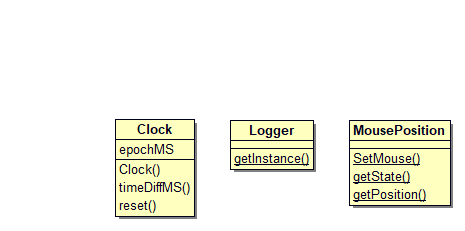

# Utilities Overview
The utilities subsection contains 3 helper classes available throughout the engine:  
  
1. [Clock](#clock-overview)  
2. [Logger](#logger-overview)  
3. [MousePosition](#mouseposition-overview)  
  
*Class diagram*  
  
## Clock Overview  
The Clock class stores the Epoch time in milliseconds that it was instantiated. It provides the ability to calculate the time difference between itself and another clock instance in milliseconds, and the ability to reset the clock to the current now Epoch time.  
  
### Implementation  
[Clock.cpp](https://cseegit.essex.ac.uk/ce301_2020/ce301_allport_michael_s/-/blob/master/GameEngine/src/GE/Clock.cpp)  
[Clock.h](https://cseegit.essex.ac.uk/ce301_2020/ce301_allport_michael_s/-/blob/master/GameEngine/src/GE/Clock.h)  
  
### Main method identification  
**timeDiffMS(Clock&)** - returns the time difference in milliseconds between caller instance and instance passed as argument  
  
## Logger Overview  
The logger class utilizes the library spdlog, which enables colour formatted console message output with functions such as time, class name etc. This class is a static singleton design. 4 pre-processor macros are given:  
  
1. GE_ERROR(...)  
2. GE_WARN(...)  
3. GE_INFO(...)  
4. GE_FATAL(...)  
  
These macros allow for pre-defined spd_log colour messages throughout the engine.

The design and implementation of this class is adapted from [5].  
  
### Implementation
[Logger.cpp](https://cseegit.essex.ac.uk/ce301_2020/ce301_allport_michael_s/-/blob/master/GameEngine/src/GE/Logger.cpp)  
[Logger.h](https://cseegit.essex.ac.uk/ce301_2020/ce301_allport_michael_s/-/blob/master/GameEngine/src/GE/Logger.h)  
  
### Main function identification - besides macros previously stated
**getInstance()** - returns the spd::logger instance with logging format instantiated in private init() method.
  
## MousePosition Overview  
Mouse position is a static singleton class providing the ability to attain its state and to attain the mouse position within the GLFW window, with origin 0,0 being the top left corner of the renderable screen.  
  
### Implementation  
[MousePosition.cpp](https://cseegit.essex.ac.uk/ce301_2020/ce301_allport_michael_s/-/blob/master/GameEngine/src/GE/MousePosition.cpp)  
[MousePosition.h](https://cseegit.essex.ac.uk/ce301_2020/ce301_allport_michael_s/-/blob/master/GameEngine/src/GE/MousePosition.h)  

### Main method identification  
**getState()** - returns the singleton instance of MousePosition.  
**getPosition()** - returns the glm::vec2 position of the mouse.  
  
# References
[5] Y. Chernikov, Hazel Engine. 2021. [Online]. Available: https://github.com/TheCherno/Hazel [Accessed: 15-Apr- 2021]
