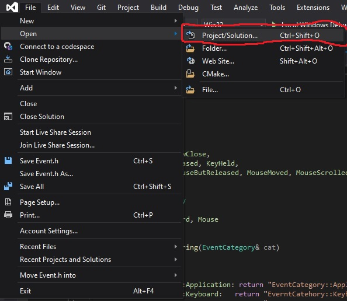
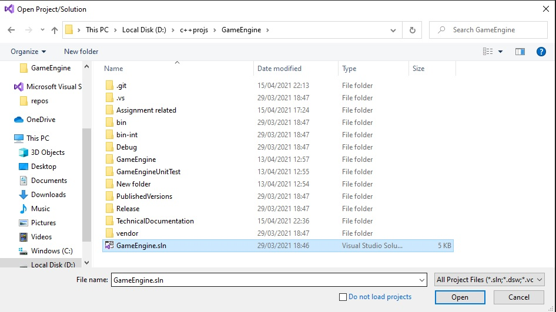

# Getting Started (Software requirements)
Versions are located **[here](https://github.com/MikeAllport/CE301-Final-Year-Project/tree/main/TechnicalDocumentation/Introduction/Versions)**
To run, choose a version number of the version you would like to run, download and extract all folders/programs, locate and execute 'GameEngine.exe' from inside the associated version folder to play.  
  
## Prerequisites
* Windows 10 (Win32) operating system x86/64  
* [Microsoft C++ Redistributable 2015-2019](https://support.microsoft.com/en-gb/help/2977003/the-latest-supported-visual-c-downloads)  
* Visual Studio - for compilation and source projects  
  
## Running Tests and released versions
Each version, excluding 'final 2.0', comes with its own testing interface running the features being developed during that version’s lifecycle. The **[version](https://github.com/MikeAllport/CE301-Final-Year-Project/tree/main/TechnicalDocumentation/Introduction/Versions)** page pertains main features that were developed for each version, and contains comments regarding the tests available. 
  
To execute a release, follow a link in the **[versions](https://github.com/MikeAllport/CE301-Final-Year-Project/tree/main/TechnicalDocumentation/Introduction/Versions)** page for the version you want to run. These directories contain fully compiled programs executable for a system running Windows 10. Download and extract all files. Execute the GameEngine.exe executable from the version's directory.  
  
Unit tests can be found in the GameEngineUnitTest directory and can be run through the Visual Studio Test Explorer, however tests are detailed and execution shown in the subsections of the technical documentation for associated classes.  
  
## Loading Visual Studio projects
The main solution file is location in the root git directory with filename 'GameEngine.sln'. The entire git directory should be downloaded and extracted. From Visual Studio, select File-\>Open-\>Project/Solution (picture 1), and select the GameEngine.sln file (picture 2)  
  
  
  
  
  
# GettingStarted (Hardware requirements)
* OpenGL v450 compatible graphics card
